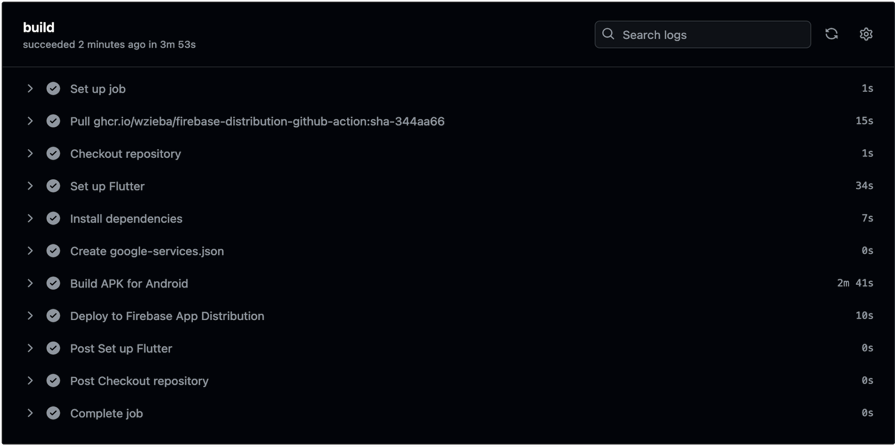

# FLUTTER APP DISTRIBUTION

## Deploying a Flutter App to Firebase App Distribution Using GitHub Actions

This repository contains a Flutter application with a GitHub Actions workflow configured to deploy the app to Firebase App Distribution for Android.
This guide explains how to set up and use the workflow.

## Overview

The GitHub Actions workflow automates the process of building and deploying your Flutter app to Firebase App Distribution whenever changes are pushed to the `master` branch (or any branch you configure).

## Prerequisites

1. **Firebase Project**: You need a Firebase project with Firebase App Distribution enabled. Follow [Firebase's documentation](https://firebase.google.com/docs/app-distribution) to set it up.

2. **Firebase Service Account**: Create a Firebase service account and download the JSON key file. This file will be used to authenticate with Firebase. Follow [Firebase's documentation](https://firebase.google.com/docs/app-distribution/authenticate-service-account?platform=ios) to set it up.

3. **GitHub Repository Secrets**: Store sensitive information in your GitHub repository secrets.


## GitHub Repository Secrets

Add the following secrets to your GitHub repository if you are not adding the `google-services.json` manually :

- `GOOGLE_SERVICES_JSON`: Base64-encoded contents of your `google-services.json` file. You can encode it using the following command:
  ```bash
  base64 -i app/google-services.json -o app/base64_google-services.txt


# RESULT 
- Result after successful build
